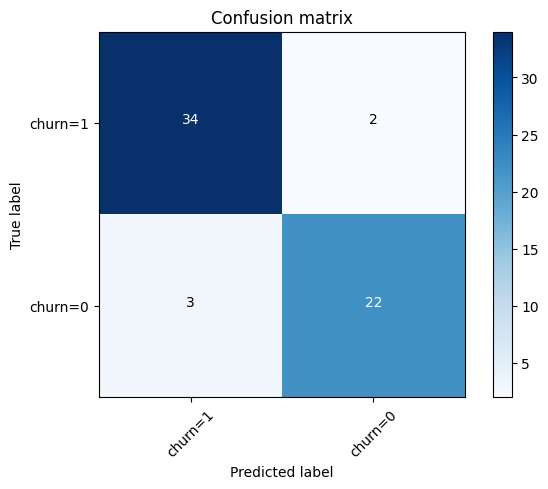

## Heart Attack Prediction using Machine Learning

This repository contains a machine learning project for predicting the possibility of a heart attack based on parameters such as blood pressure and age. The <b>classification</b> models implemented in this project include:
- K-Nearest Neighbors (KNN)
- Decision Trees
- Logistic Regression
- Support Vector Machines (SVM).

## Dataset

The dataset used for this project consists of several features, including blood pressure,cholesterol and Fasting Blood Sugar along with the target variable indicating whether a heart attack occurred or not. you can easily find publicly available heart attack datasets online or in machine learning libraries such as scikit-learn.

## Result 

After checking and changing the parameters of each of the above methods, I was able to obtain the highest percentage of accuracy for each of the methods.
The methods reached the highest accuracy by using different number of features in the database. For example, KNN method was able to reach 93 percent by using 7 features, while SVM method needed 10 features to reach this level of accuracy. This shows that KNN method is more optimal.
But in general, all four methods used reached the same level of accuracy (93 percent).

You can see the final result in the table below:

